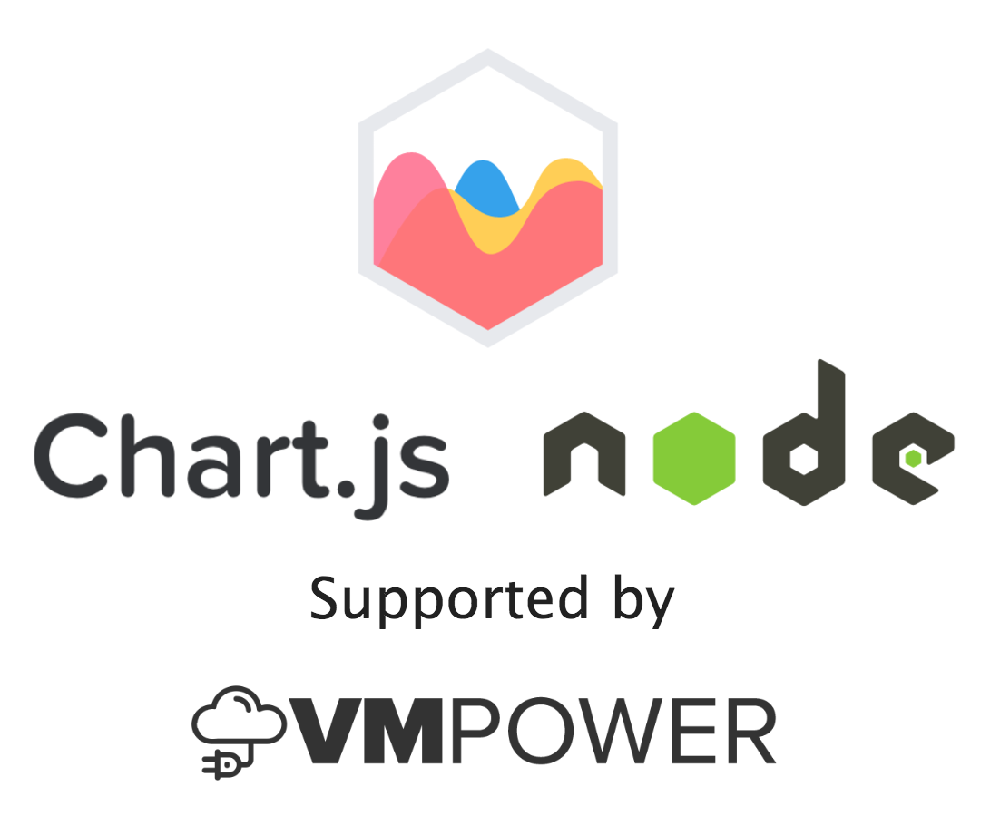

[](https://travis-ci.org/vmpowerio/chartjs-node)
[](https://codeclimate.com/github/vmpowerio/chartjs-node)

# Chartjs-Node

A simple library to make it easy to create Chartjs charts in Node.js (server-side).

This library puts together [jsdom](https://github.com/tmpvar/jsdom), [node-canvas](https://github.com/Automattic/node-canvas) and [chartjs](https://github.com/chartjs/Chart.js) to render Chartjs on the server.

## Getting Started

### Peer Dependencies

You'll need to npm install `chart.js`. This library will pick up the exact version you end up installing.

### Cairo

Before installing this library you'll need to install Cairo for your system. The instructions for the most common platforms can be found [here](https://github.com/Automattic/node-canvas#installation).

Now you're ready to install the package:

```
npm install chartjs-node
```

## Creating a Chart

```js
const ChartjsNode = require('chartjs-node');
// 600x600 canvas size
var chartNode = new ChartjsNode(600, 600);
return chartNode.drawChart(chartJsOptions)
.then(() => {
    // chart is created

    // get image as png buffer
    return chartNode.getImageBuffer('image/png');
.then(buffer => {
    Array.isArray(buffer) // => true
    // as a stream
    return chartNode.getImageStream('image/png');
.then(streamResult => {
    // using the length property you can do things like
    // directly upload the image to s3 by using the
    // stream and length properties
    streamResult.stream // => Stream object
    streamResult.length // => Integer length of stream
    // write to a file
    return chartNode.writeImageToFile('image/png', './testimage.png');
})
.then(() => {
    // chart is now written to the file path
    // ./testimage.png
});
```

## Destroying the Chart

Each time you create a chart, you will create a new virtual browser `window`. You should call the `destroy`
method to release the native resources or you may leak memory:

```
chartNode.destroy();
```

## Adding draw plugins

To use draw plugins, simply use the ``options`` object to add your plugins, like so:
```
var myOptions = {
    plugins: {
        afterDraw: function (chart, easing) {
            var self = chart.config;    /* Configuration object containing type, data, options */
            var ctx = chart.chart.ctx;  /* Canvas context used to draw with */
            ...
        }
    }
}

var chartJsOptions = {
    type: 'pie',
    data: myData,
    options: myOptions
}

```
[ChartJS Plugin Documentation](http://www.chartjs.org/docs/#advanced-usage-creating-plugins)

Read here to see what plugins you can write. In the context of drawing static images, ``beforeDraw`` and/or ``afterDraw`` methods makes most sense to implement.

[CanvasRenderingContext2D](https://developer.mozilla.org/en/docs/Web/API/CanvasRenderingContext2D)

Read here to see which methods are available for the ``ctx`` object.
